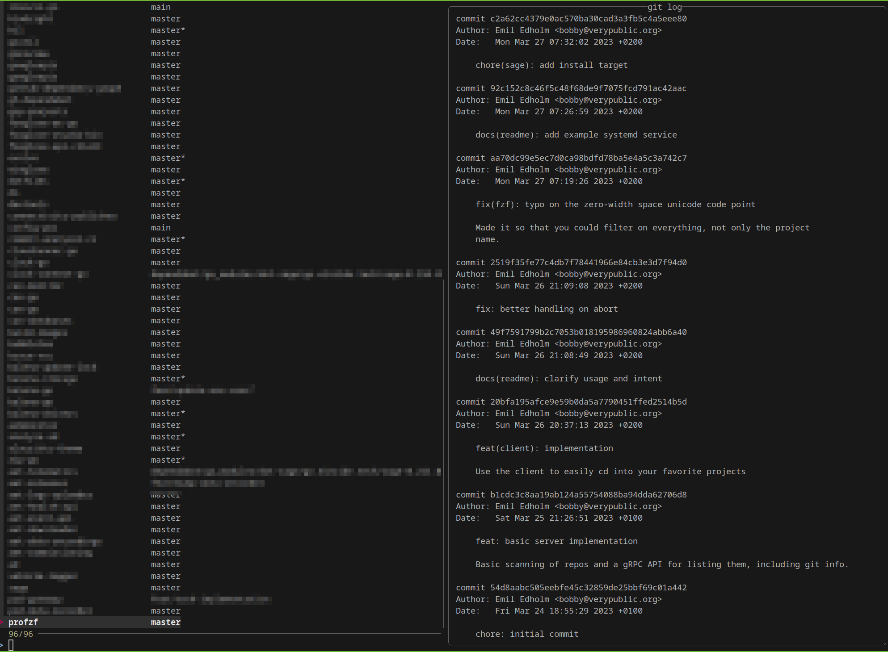

profzf
======

Profzf consists of a server and client (in the same binary). The server sits in the background and scans for your git repositories and caches them locally in an sqlite database.

The client is a simple wrapper around fzf that allows you to quickly search for your projects. Mainly intended for use with `cd`



Usage
=====

Building
--------

You can manually build the application using the normal Go toolchain:

```shell
make build
./profzf --help
```

Installation
------------

To install profzf into your `$GOPATH` run:

```shell
make install
$GOPATH/bin/profzf --help
```

Run `profzf server` to start the server. Use the `--project-dir` (can be specified multiple times) to specify the directories to scan for git repositories.

Then run `profzf cd` to output an example command that uses `fzf` and `jq` to cd into the selected project.

For example, I use it like this:

```shell
alias cdp='eval $(profzf cd)'
```

The server can be started by a systemd user service. Here is an example:

```
# ~/.config/systemd/user/profzf.service
# systemctl --user enable --now profzf
[Unit]
Description=Starts profzf server

[Service]
Type=simple
Restart=always
ExecStart=%h/go/bin/profzf server -p %h/code -p %h/go/src
KillMode=process
TimeoutSec=180

[Install]
WantedBy=default.target
```

*`%h` is the home directory*
